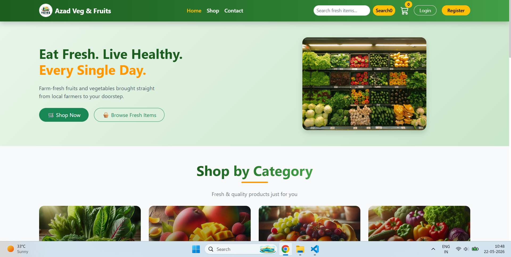

# 🥬 Azad Veg & Fruits Shop

An online vegetable and fruits e-commerce web application built using the MERN stack.

## 🚀 Features

✅ User Authentication (Login / Register)  
✅ Browse Categories  
✅ View Fresh Fruits & Vegetables  
✅ Add to Cart  
✅ Place Orders  
✅ Responsive Design  
✅ Admin Dashboard  
✅ Product Management  
✅ Category Management  

---

## 🛠 Tech Stack

### Frontend
- React.js
- React Router
- Bootstrap / CSS
- Axios

### Backend
- Node.js
- Express.js
- MongoDB
- Mongoose
- JWT Authentication

---

## 📸 Screenshots

(my project screenshots here)

Example:


---

## 📂 Folder Structure

```bash
azad-veg-and-fruits/
│
├── client/
│   ├── src/
│   └── package.json
│
├── server/
│   ├── models/
│   ├── routes/
│   ├── controllers/
│   └── package.json
│
└── README.md
```

---

## ⚙️ Installation

### Clone Repository

```bash
git clone https://github.com/ShamiAzad91/azad-veg-and-fruits.git
cd azad-veg-and-fruits
```

### Install Dependencies

Frontend:
```bash
cd client
npm install
```

Backend:
```bash
cd server
npm install
```

---

## 🔑 Environment Variables

Create `.env` file inside server folder:

```env
PORT=5000
MONGO_URL=your_mongodb_connection
JWT_SECRET=your_secret_key
CLIENT_URL=http://localhost:5173
```

---

## ▶️ Run Project

Backend:
```bash
cd server
npm run dev
```

Frontend:
```bash
cd client
npm run dev
```

---

## 👨‍💻 Author

**Azad Shami**  
MERN Stack Developer

GitHub:https://github.com/ShamiAzad91

---

## 🌟 Future Improvements

- Online Payment Integration
- Order Tracking
- Wishlist Feature
- Product Search & Filter
- Delivery Status Tracking

---

## 📜 License

This project is for learning and portfolio purposes.
